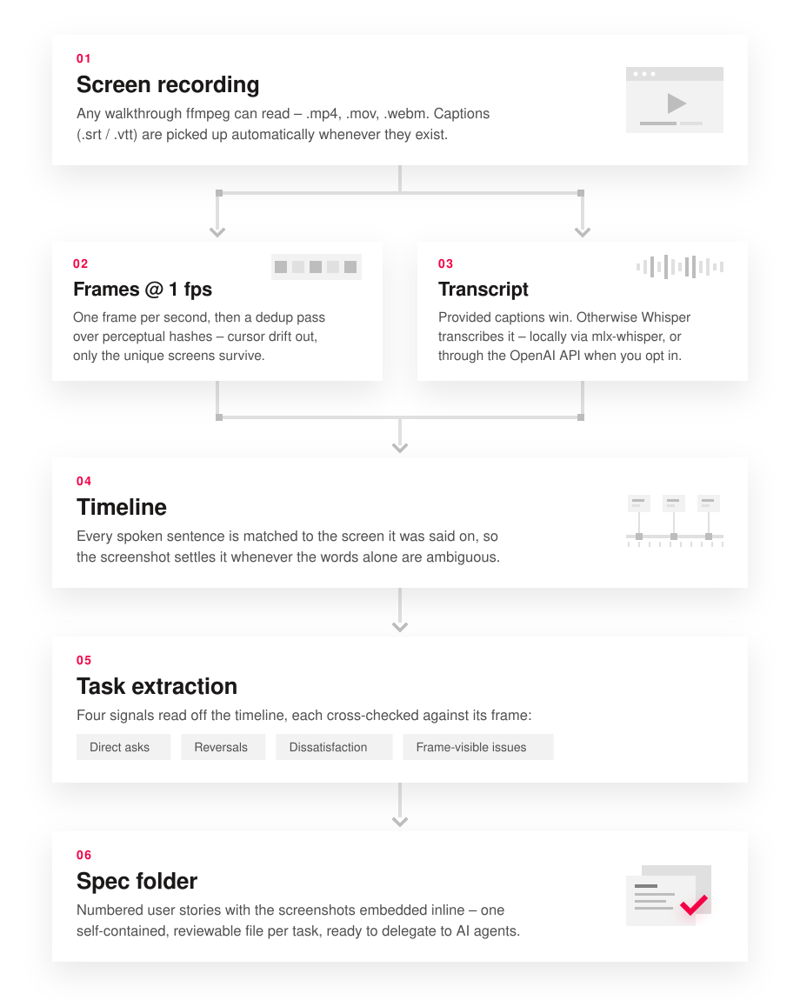
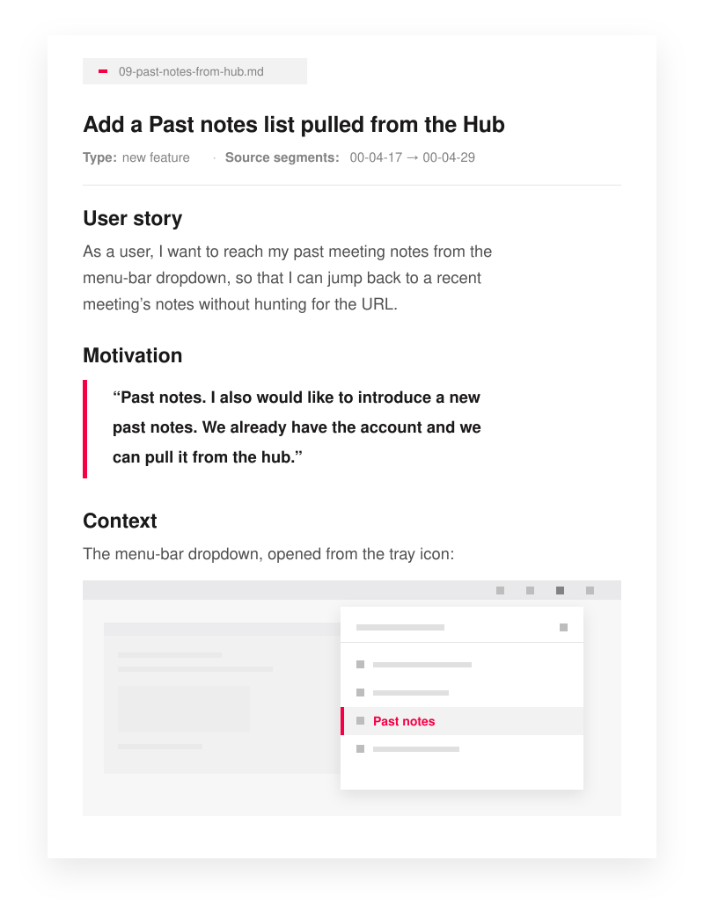

# public-skills

Skills by Everlabs for AI coding agents – Claude Code, Codex, Cursor, OpenCode, Gemini CLI, and any other harness that supports the SKILL.md standard. Each skill is a self-contained folder with its own README, author credits, and everything it needs to run.

Install one by feeding it to your agent: copy the skill folder into your agent's skills directory (e.g. `~/.claude/skills/` for Claude Code, `~/.codex/skills/` for Codex), or just tell your agent to install it from this repo.

## Skills

### [video-to-spec](video-to-spec/)

*by Oleg Pasko @ Everlabs*

Turns a screen-recording walkthrough (Loom, QuickTime, anything ffmpeg reads) into reviewable user-story specifications – each task with the exact screenshots the speaker was looking at when they said it. Record yourself thinking out loud while browsing the product you want to improve; get back clarified, delegable specs your AI agents (or team) can implement.

<table>
  <tr>
    <th>How it works</th>
    <th>What you get</th>
  </tr>
  <tr>
    <td width="50%" valign="top">
      
    </td>
    <td width="50%" valign="top">
      
    </td>
  </tr>
</table>

The video is cut into one frame per second with ffmpeg, then deduplicated by perceptual hash (ImageMagick PHASH or Python `imagehash`) so mouse drift is ignored but real screen changes – modals, scrolls, navigation – survive. Each transcript segment is matched to the screen state that was visible when it was spoken, and the specs are drafted from that timeline with the screenshots embedded. One batch of clarifying questions at the end confirms anything ambiguous before the folder is final.

See the [skill README](video-to-spec/README.md) for install, dependencies, and transcription providers.
